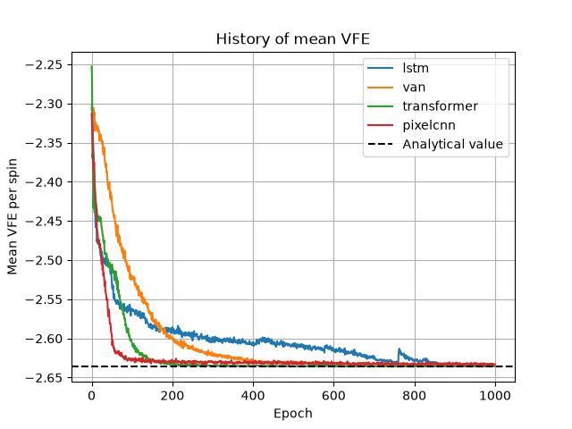
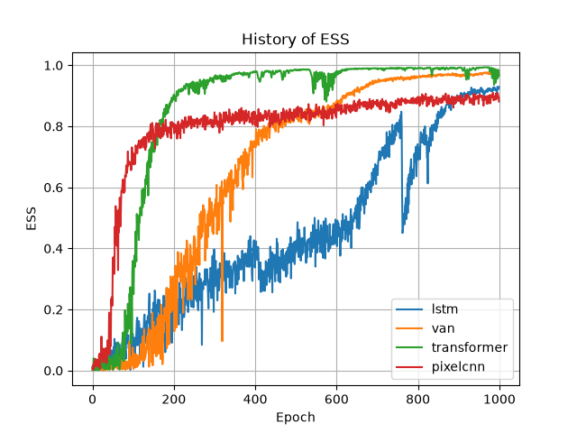

# Autoregressive Neural Networks for Boltzmann Distribution Sampling

The goal of this project is to investigate how different model architectures learn complex probability distributions and how they differ in terms of convergence, sample quality, computational cost, and training stability.

This project compares different autoregressive neural network architectures for sampling from the Boltzmann distribution.

The compared architectures are:

Variational Autoregressive Network (VAN)
PixelCNN
LSTM
Decoder-only Transformer

The project is implemented in PyTorch.

---
## Results

The models are evaluated using:

* Variational Free Energy (VFE)
* Effective Sample Size (ESS)
* Energy statistics
* Magnetization
* Training time
* Sampling time
* Number of trainable parameters

### Final comparison

| Model       | VFE       | ESS      | Parameters | Training Epochs | Sampling Time |
| ----------- | --------: | -------: | ---------: | --------------: | ------------: |
| VAN         | -2.635120 | 0.970338 |      8,320 |            1000 |      0.307426 |
| PixelCNN    | -2.632983 | 0.899292 |    207,233 |            1000 |      0.891203 |
| LSTM        | -2.633827 | 0.922628 |      9,046 |            1000 |      0.503861 |
| Transformer | -2.634910 | 0.959089 |     54,337 |            1000 |      1.704755 |

### Metrics description

- **VFE** – average Variational Free Energy computed from 100 independent sampling runs of the trained model. It measures how well the learned distribution approximates the target distribution. Values closer to the analytical reference indicate better performance.

- **ESS** – average Effective Sample Size computed from 10 independent sampling runs. It reflects the quality of the generated samples and the efficiency of the learned distribution. Values closer to 1 indicate better sampling quality.

- **Parameters** – total number of trainable parameters in the model, representing its size and model complexity.

- **Training Epochs** – total number of training epochs used for the final experiment. All models were trained for the same number of epochs to ensure a fairer comparison.

- **Sampling Time** – time required to generate samples during the final evaluation. Lower values correspond to faster sample generation.

---

## Example Visualizations

### Variational Free Energy



### Effective Sample Size



---

## Research Question

The main research question is:

> How does neural network architecture affect the ability of autoregressive generative models to learn and sample from a complex Boltzmann probability distribution?

The project focuses not only on final model quality, but also on trade-offs between accuracy, convergence speed and computational cost.

---

## Models

### VAN

A fully connected autoregressive model using masked linear layers.

The joint probability distribution is factorized as:

$$
q(x) = \prod_{i=1}^{N} q(x_i \mid x_1, \ldots, x_{i-1})
$$

Each variable is sampled sequentially from a conditional probability predicted by the network.

### PixelCNN

A convolutional autoregressive architecture using masked convolutions.

PixelCNN can exploit spatial relationships while preserving autoregressive ordering.

The implementation uses:

* Mask A in the first layer
* Mask B in subsequent layers
* convolutional feature channels
* autoregressive sampling

### LSTM

The configuration is represented as a sequence and generated one element at a time.

The LSTM uses previous generated values as input and predicts the probability of the next value.

The model can optionally receive additional positional information.

### Transformer

A decoder-only Transformer using causal self-attention.

The architecture contains:

* token embeddings
* positional embeddings
* causal self-attention
* feed-forward layers
* layer normalization
* linear prediction head

Causal masking prevents the model from accessing future values during autoregressive generation.

---

## Project Structure

```text
## Project Structure

```text
.
├── experiments/
│   ├── configs/
│   │   ├── best_models/
│   │   │   ├── lstm.yaml
│   │   │   ├── pixelcnn.yaml
│   │   │   ├── transformer.yaml
│   │   │   └── van.yaml
│   │   │
│   │   ├── Lstms/
│   │   ├── PixelCnns/
│   │   ├── Transformers/
│   │   └── Vans/
│   │
│   └── hyperparams/
│       ├── run_lstm.py
│       ├── run_pixelcnn.py
│       ├── run_transformer.py
│       └── run_van.py
│
├── notebooks/
│   └── analysis.ipynb
│
├── results/
│   ├── figures/
│   └── tables/
│
├── src/
│   ├── models/
│   │   ├── lstm.py
│   │   ├── pixelcnn.py
│   │   ├── transformer.py
│   │   └── van.py
│   │
│   ├── metrics/
│   │   └── metrics.py
│   │
│   ├── trainer/
│   │   └── trainer.py
│   │
│   └── visualization/
│       └── plots.py
│
├── run_experiment.py
├── requirements.txt
└── README.md
```
Directory description
- experiments/configs/ – YAML configuration files defining model architectures and training hyperparameters.
- experiments/configs/best_models/ – configurations selected for the final comparison between the four architectures.
- experiments/hyperparams/ – scripts used to run architecture-specific hyperparameter experiments.
- src/models/ – implementations of VAN, PixelCNN, LSTM and Transformer models.
- src/trainer/ – shared training logic used by the models.
- src/metrics/ – evaluation functions for VFE, ESS and other experiment metrics.
- src/visualization/ – functions responsible for generating and saving plots.
- results/tables/ – numerical results generated during experiments.
- results/figures/ – generated plots and model comparison figures.
- notebooks/analysis.ipynb – analysis and visualization of the experimental results.
- run_experiment.py – main entry point used to launch hyperparameter experiments, the final comparison, or both.
---

## Experimental Pipeline

Each experiment follows the same general pipeline:

```text
Configuration
      ↓
Model initialization
      ↓
Autoregressive sampling
      ↓
Loss calculation
      ↓
Backpropagation
      ↓
Metric calculation
      ↓
Saved results
      ↓
Final analysis
```

Keeping the training and evaluation pipeline shared between models makes the comparison more consistent.

---

## Configuration

Model settings are stored in YAML files.

Example:

```yaml
model: transformer

lattice_size: 8
beta: 0.3

training:
  epochs: 5000
  batch_size: 1024
  learning_rate: 0.001

model_params:
  embedding_dim: 64
  num_heads: 4
  num_layers: 3
```

This makes experiments reproducible without modifying the source code.

---

## Evaluation

### Variational Free Energy

The main optimization objective is:

$$
F_q =
\mathbb{E}_{x \sim q}
\left[
E(x) + \frac{1}{\beta}\log q(x)
\right]
$$

Lower VFE indicates a better approximation of the target distribution.

### Effective Sample Size

Sample quality is additionally evaluated using effective sample size:

$$
ESS =
\frac{
\left(\sum_i w_i\right)^2
}{
\sum_i w_i^2
}
$$

The normalized ESS is:

$$
ESS_{\text{norm}} = \frac{ESS}{N}
$$

where \(N\) is the number of samples.

### Additional Metrics

The project also tracks:

* energy
* magnetization
* convergence curves
* training time
* sampling time
* parameter count

---

## Analysis

The main experimental analysis is located in:

```text
notebooks/analysis.ipynb
```

The notebook contains:

1. experiment setup
2. result loading and validation
3. VFE convergence comparison
4. ESS comparison
5. energy analysis
6. magnetization analysis
7. final conclusions

The notebook is used for analysis and visualization only. Model implementation and training logic are kept in the source files.

---

## Installation

Clone the repository:

```bash
git clone <repository-url>
cd <repository-name>
```

Create a virtual environment:

```bash
python -m venv .venv
```

Activate it on Windows:

```bash
.venv\Scripts\activate
```

On Linux/macOS:

```bash
source .venv/bin/activate
```

Install dependencies:

```bash
pip install -r requirements.txt
```

---

## Running Experiments

Experiments are launched through the main script:

```bash
python run_experiment.py <mode>
```

The first command-line argument determines which experiments will be executed.

Available options are:

- `a` — runs **all experiments**, including hyperparameter tests and the final model comparison,
- `h` — runs **only hyperparameter experiments**,
- `e` — runs **only the final experiment**, comparing the selected best configurations of all models.

Examples:

Run all experiments:

```bash
python run_experiment.py a
```

Run only hyperparameter tests:

```bash
python run_experiment.py h
```

Run only the final model comparison:

```bash
python run_experiment.py e
```

The final experiment trains and evaluates the selected best configurations of:

```text
Transformer
    ↓
LSTM
    ↓
PixelCNN
    ↓
VAN
```

After training, evaluation results are saved and comparison plots are generated.

---

## Technologies

* Python
* PyTorch
* NumPy
* Pandas
* Matplotlib
* Jupyter Notebook
* YAML
* Git

---
